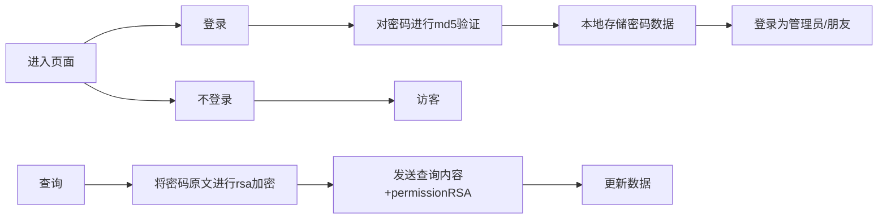
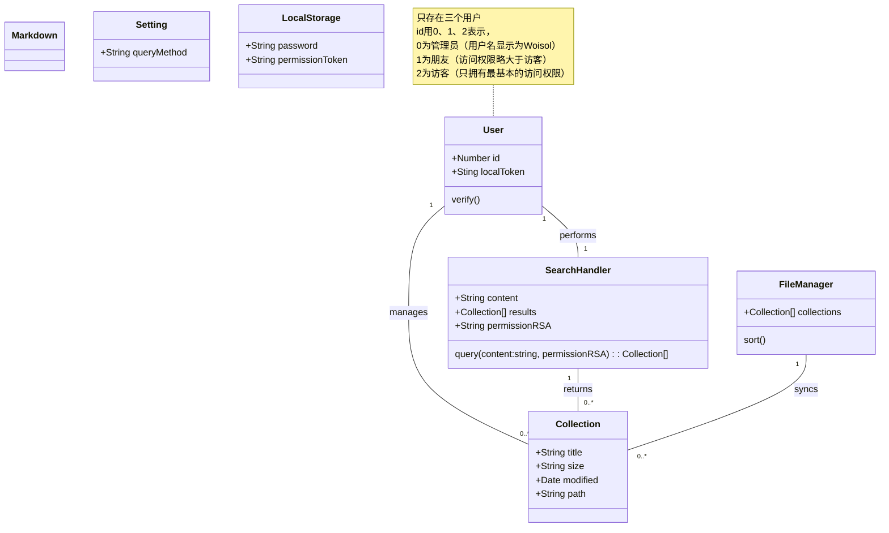

# Requirement

## Idea

* 数据结构：
  type: web | app
  title
  tags: string[]
  path/fetch
  create: Date
* +表情包聚合
* 考虑加入收藏时犹豫该放到那个位置的问题，考虑用ai介入
* 置顶！
  25-02-22
  目前使用硬盘 + autoindex / alist webdav来实现，有两个实现方向
  平台收藏夹整理，服务器定时同步更新
  优点：
  收藏方便，不需要 复制连接->打开alist->选择分类->编辑ms的复杂操作
  浏览器可以考虑做个插件

缺点：
现有收藏夹整理困难
估计只能做到平台收藏夹对应一个分类，多平台融合逻辑可能难做，排序上可能较难
在py脚本内部预先排序？
考虑支持多个URL.md？

放弃平台收藏夹，完全使用自建收藏夹
优点：
分类完全自定义
不需要重新整理当前收藏夹
缺点：
收藏困难，需要繁杂操作。
考虑专门做个app简化操作？
Unclassified？

## 03-10

考虑manual.top.md和manual.md
考虑删去重复，在最后处理即可？

## 04-14

使用next搭建一个支持搜索的！********
兼容nginx，简单打开autoindex就可以支持优雅查看
支持搜索！另外使用py来实现完整路由访问
用户登录，访客不允许访问部分敏感文件夹

## 以上from affine

### 04-18

考虑推荐流！

## 用例图

[Drawio](/docs/UseCase.drawio)

## 流程图

## 数据模型

<!-- !不行……从头自己思考一遍…… -->

### 加密流程设计

1. 本地使用md5验证密码确定登录用户
2. 后台请求使用密码再次进行rsa加密后发送
    理清思路！前端验证md5必然写入代码，在md5上继续加密必然会可以通过枚举绕过
    使用rsa对密码原文重新加密再发送应该就无法破解。

## 原型设计

[Figma](https://www.figma.com/design/DFAvhMmE2lpVq2HF6mQZpr/CollectionFetch?node-id=0-1&t=1Khxv9XddWJQzQ6B-1)
